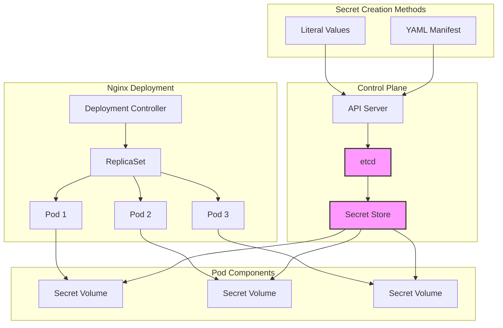

# 🔐 Kubernetes Secrets: Secure Volume Mounting Implementation

[](https://github.com/TheToriqul/k8s-secret-volume)


## 📋 Project Overview

This project demonstrates my implementation of secure credential management in Kubernetes using Secrets and volume mounting. Through this hands-on implementation, I've developed a secure way to manage sensitive data in Kubernetes deployments, focusing on best practices for handling authentication credentials.

## 🎯 Key Objectives

- Implement secure credential management using Kubernetes Secrets
- Master volume mounting techniques for sensitive data
- Configure secure Nginx deployments with mounted credentials
- Demonstrate best practices for Kubernetes secret management
- Validate secure access to mounted credentials

## 🏗️ Project Architecture



## 💻 Technical Stack

- **Container Platform**: Kubernetes
- **Web Server**: Nginx 1.17.0
- **Secret Type**: kubernetes.io/basic-auth
- **Deployment Type**: Multi-pod with volume mounting
- **Access Control**: Read-only volume mounts

## 🚀 Getting Started

<details>
<summary>🐳 Prerequisites</summary>

- Kubernetes cluster (1.15+)
- kubectl CLI tool
- Access to create Secrets and Deployments
- Basic understanding of Kubernetes concepts

</details>

<details>
<summary>⚙️ Implementation Steps</summary>

1. Create the basic-auth secret:
   ```bash
   kubectl create secret generic basic-auth \
     --from-literal=username=super \
     --from-literal=password=my-s8cr3t
   ```

2. Deploy Nginx with mounted secret:
   ```bash
   kubectl apply -f nginx-deploy-secret.yaml
   ```

3. Verify the implementation:
   ```bash
   kubectl get secrets
   kubectl get pods
   ```

For detailed commands and validations, refer to the [reference-commands.md](reference-commands.md) file.

</details>

## 💡 Key Learnings

### Technical Mastery:

1. Kubernetes Secrets management and security best practices
2. Volume mounting configuration and security considerations
3. Deployment scaling with secure credential access
4. Container security in multi-pod deployments
5. Secret validation and verification techniques

### Professional Development:

1. Security-first approach to configuration management
2. Best practices for handling sensitive data in containers
3. Documentation of secure implementations
4. Troubleshooting and validation methodologies
5. Infrastructure as Code principles

## 🔄 Future Enhancements

<details>
<summary>View Planned Improvements</summary>

1. Implement automatic secret rotation
2. Add mutual TLS authentication
3. Integrate with external secret management systems
4. Implement pod security policies
5. Add monitoring and alerting for secret access
6. Implement multi-environment secret management

</details>

## 🤝 Connect with Me

- 📧 Email: toriqul.int@gmail.com
- 📱 Phone: +65 8936 7705, +8801765 939006
- 🌐 LinkedIn: [@TheToriqul](https://www.linkedin.com/in/thetoriqul/)
- 🐙 GitHub: [@TheToriqul](https://github.com/TheToriqul)
- 🌍 Portfolio: [TheToriqul.com](https://thetoriqul.com)

## 👏 Acknowledgments

- [Poridhi](https://devops.poridhi.io/) for providing the learning infrastructure and inspiration
- The Kubernetes community for excellent documentation and resources
- Fellow developers who provided valuable feedback and insights

---

Thank you for exploring my Kubernetes Secrets implementation. I hope this project demonstrates effective secure credential management in Kubernetes environments! 🚀