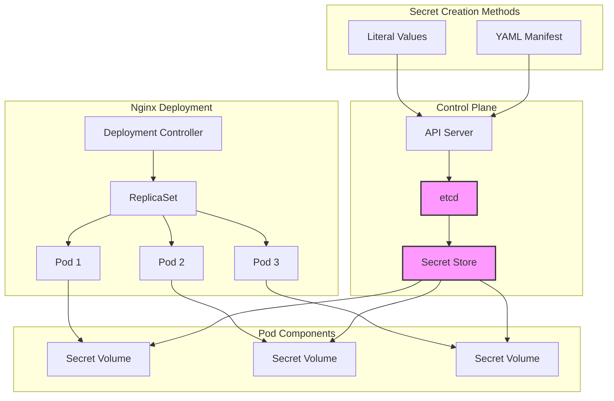

# Kubernetes Secrets Architecture: Volume Mounting Implementation

## System Components

### 1. Control Plane Components
- **K8s Master**: Manages the overall cluster state and coordination
- **etcd**: Stores all cluster data, including Secrets
- **API Server**: Handles all API operations for Secret management

### 2. Secret Management
- **Secret Store**: 
  - Type: kubernetes.io/basic-auth
  - Storage: Encrypted at rest in etcd
  - Contents: Username and password for basic authentication

### 3. Deployment Architecture
- **Nginx Deployment**:
  - Replicas: 3 pods
  - Image: nginx:1.17.0
  - Volume Configuration: Read-only Secret mount

### 4. Volume Mounting
- **Mount Path**: /etc/secret
- **Access Mode**: Read-only
- **Mount Type**: Secret Volume
- **Files Created**: 
  - /etc/secret/username
  - /etc/secret/password

## Architectural Flow

## Security Considerations

1. **Data at Rest**:
   - Secrets are stored encrypted in etcd
   - Base64 encoding for YAML manifests
   - Encryption key management handled by Kubernetes

2. **Data in Transit**:
   - TLS encryption between components
   - API server authentication required
   - RBAC controls access to secrets

3. **Pod Access**:
   - Read-only volume mounts
   - Isolated namespace access
   - Volume-specific permissions

## Implementation Benefits

1. **Security**:
   - Centralized secret management
   - Encrypted storage
   - Controlled access

2. **Scalability**:
   - Automatic secret distribution to new pods
   - Consistent across replicas
   - Efficient updates

3. **Maintainability**:
   - Declarative configuration
   - Version control friendly
   - Easy secret rotation

## Best Practices

1. **Secret Management**:
   - Use unique secrets per environment
   - Implement regular secret rotation
   - Limit secret access with RBAC

2. **Deployment**:
   - Always use read-only mounts
   - Implement pod security policies
   - Monitor secret usage

3. **Operations**:
   - Regular secret auditing
   - Backup procedures
   - Access logging
